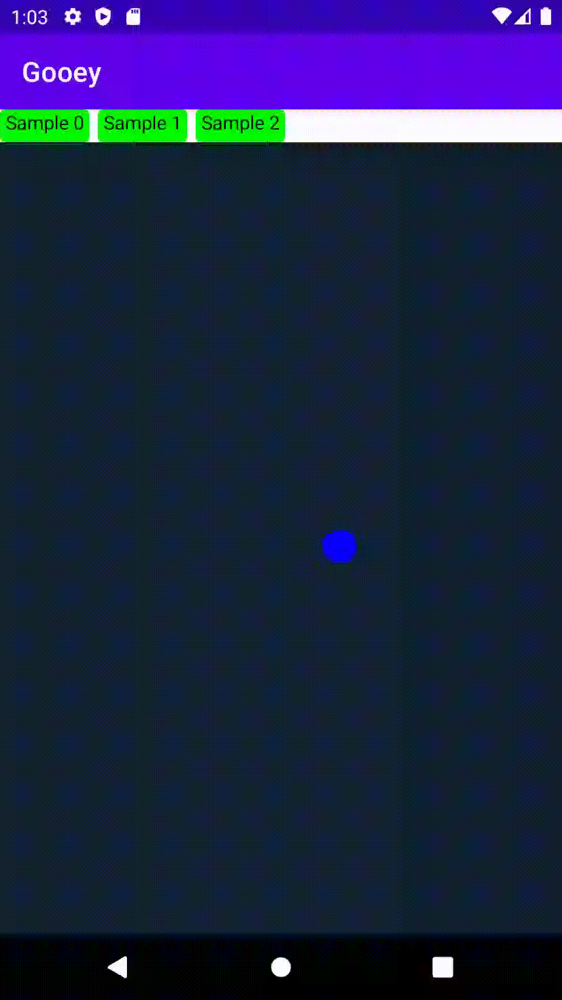

<p align="center">
<h1 align="center">Gooey effect for android-compose</h1>
</p>

<p align="center">
  
  
  
</p>

"Gooey" is a library made to use "gooey-effect" that exists as a CSS trick in android-compose.

## Download
```gradle
repositories {
    ...
    maven { url 'https://jitpack.io' }
}

dependencies {
  implementation 'com.github.D000L:gooey:0.1.1'
}
```

## Usage

1. Apply "gooeyEffect" Modifier
2. Change 'background' to 'gooey' in the child layout to apply "gooey-effect"

```kotlin
Box(modifier = Modifier.gooeyEffect(), contentAlignment = Alignment.Center) {
    for (i in 0 until 3) {
        Box(
            modifier = Modifier
            ...
            //.background(Color(0xFF4DFF94), shape = CircleShape)
            .gooeyBackground(Color(0xFF4DFF94), shape = CircleShape)
        )
    }
    Box(
        modifier = Modifier
        ...
        .gooeyBackground(Color(0xFFC4FF70), CircleShape)
    )
}
```

## Usage With Canvas

To apply "gooey-effect" to many objects
Use 'GooeyCanvas' and 'drawGooey'

```kotlin
Box(modifier = Modifier.gooeyEffect()) {
    GooeyCanvas(modifier = Modifier, onDraw = {
        blobs.forEach {
            drawGooey(
                Size(
                    with(density) { it.radius.dp.toPx() },
                    with(density) { it.radius.dp.toPx() }),
                Color(it.color),
                CircleShape,
                Offset(it.x, it.y)
            )
        }
    })

    Box(
        Modifier
            .size(80.dp)
            .offset(
                with(density) { current.x.toDp() - 40.dp },
                with(density) { current.y.toDp() - 40.dp })
            .gooeyBackground(
                Color(0xffffdd02),
                CircleShape
            )
    )
}
```

## More Sample
* https://github.com/D000L/bewait

## License
```xml
Copyright 2022 D000L (SeokHo Im)

Licensed under the Apache License, Version 2.0 (the "License");
you may not use this file except in compliance with the License.
You may obtain a copy of the License at

   http://www.apache.org/licenses/LICENSE-2.0

Unless required by applicable law or agreed to in writing, software
distributed under the License is distributed on an "AS IS" BASIS,
WITHOUT WARRANTIES OR CONDITIONS OF ANY KIND, either express or implied.
See the License for the specific language governing permissions and
limitations under the License.
```
